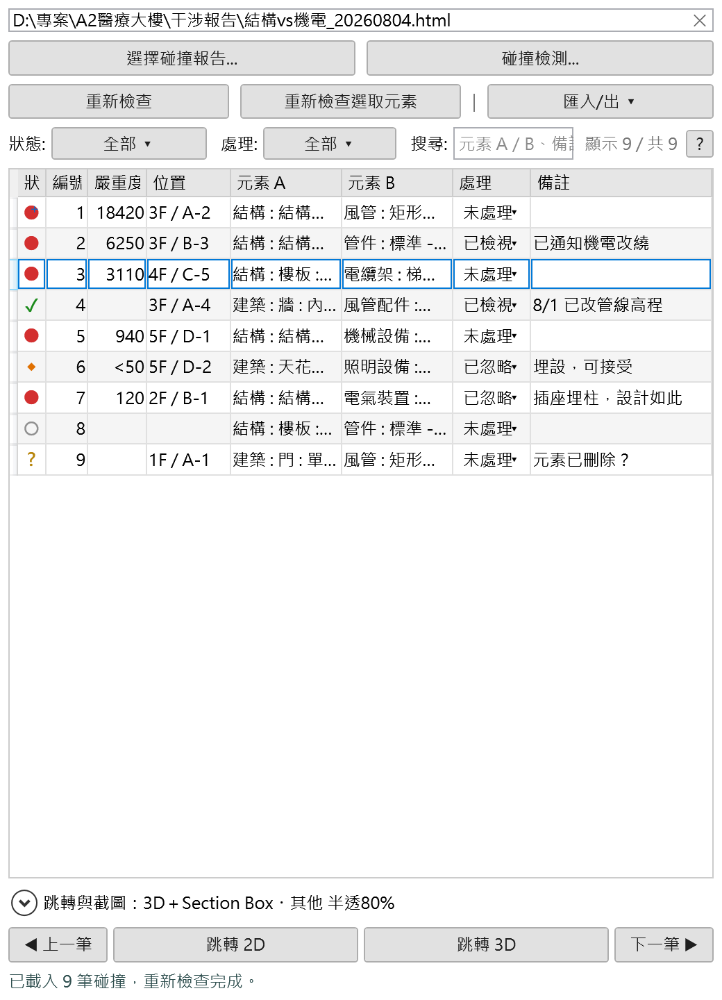
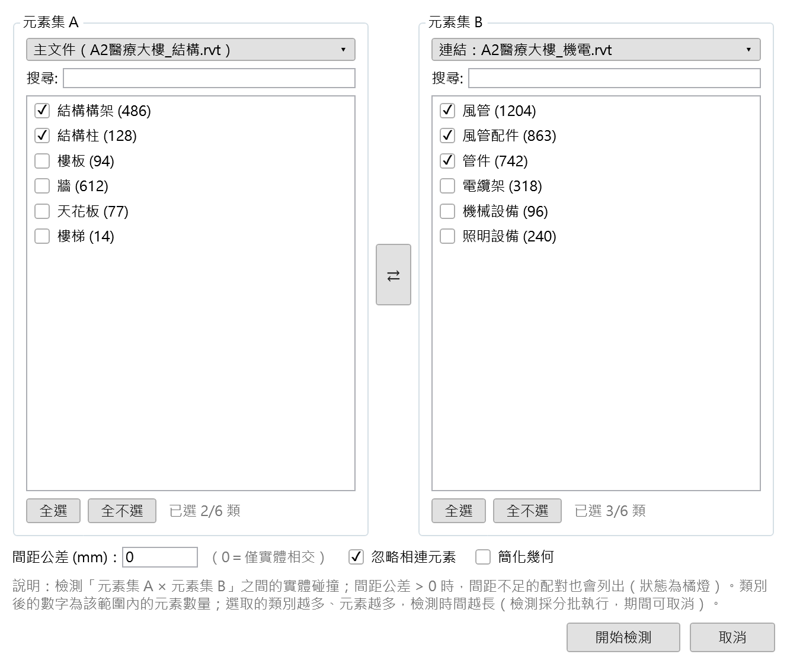
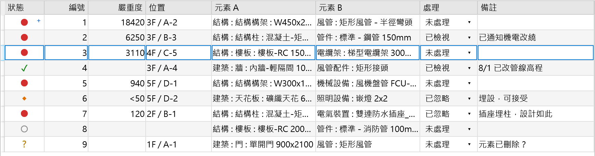

# Clash Navigator — Revit 碰撞檢視器

[](https://github.com/SodaCK87/clash-navigator-showcase/actions/workflows/ci.yml)

> **產出方式：本專案是與 Anthropic 的 Claude（Claude Code）協作開發的。**
> 需求界定、技術取捨與驗收由我把關，Claude 參與實作、測試撰寫與文件整理。
> README 裡的每一組數字都來自實機量測，不是估算——包括那些**推翻我自己判斷**的量測結果
> （見〈2. 先量再改〉）。

把 BIM 碰撞檢討從「開兩台螢幕互相比對」變成一份追得下去的清單。
起點是一支只有自己會用的 Dynamo Python 腳本，改寫成同事裝了就能用的 Revit 增益集。

- 讀 Revit 干涉報告或 Navisworks XML，也能不靠報告直接在模型上檢測
- 點一筆就選取兩個元素、切到專用工作視圖、自動取到看得見的角度
- 處理狀態與備註留得住，最後匯出成 Excel



---

## 這個 repo 是什麼

**這是展示用的節錄，不是完整的增益集。**

| 範圍 | 內容 |
| --- | --- |
| 這裡有 | 八個零 Revit 相依、可以獨立建置與跑測試的模組，加上開發過程中幾個值得講的決策與量測 |
| 這裡沒有 | WPF 面板與三個對話框、`IExternalCommand` 進入點、所有碰 `Autodesk.Revit.DB` 的服務層——它們需要 Revit 才能編譯 |
| 完整專案 | 21,404 行（不計空白行），依賴 Revit API 才能編譯 |

```bash
dotnet test tests/ClashNavigator.Showcase.Tests.csproj
```

| 環境 | 結果 |
| --- | --- |
| 本機 ／ CI Windows | **141 passed**、0 warning（兩個專案都開 `TreatWarningsAsErrors`）。不需要 Revit |
| CI Linux | 140 passed、**1 skipped** |

跳過的那個斷言「目標檔唯讀時寫入要擲例外」——Windows 的 `ReadOnly` 屬性會擋下取代，
而 POSIX 管的是**目錄**權限，檔案自己沒有寫入權仍可被 rename 蓋過去。宿主是 Revit、只跑在 Windows，
所以斷言的就是 Windows 的行為，Linux 上跳過它，**而不是把斷言放寬到兩邊都成立**——那會變成什麼都沒驗到。

### 節錄的八個模組

| 模組 | 行數 | 在做什麼 |
| --- | ---: | --- |
| [`XlsxWorkbook.cs`](src/XlsxWorkbook.cs) | 748 | 零相依的 xlsx 寫入器：`ZipArchive` ＋ 手寫 XML，支援錨定圖片、凍結窗格、自動篩選、儲存格樣式 |
| [`MeshProximityUtil.cs`](src/MeshProximityUtil.cs) | 461 | 三角網格間距判定（點-三角形／邊-邊距離） |
| [`ClashHighlightPlan.cs`](src/ClashHighlightPlan.cs) | 194 | 四個顯示設定之間的互斥規則，抽成純函式 |
| [`BoundingBoxPairFinder.cs`](src/BoundingBoxPairFinder.cs) | 185 | AABB 排序—掃描粗篩，掃描軸依資料分布自適應 |
| [`AtomicFile.cs`](src/AtomicFile.cs) | 158 | 原子寫入（暫存檔→替換）與損毀檔備份 |
| [`ClashCaptureDirection.cs`](src/ClashCaptureDirection.cs) | 142 | 十一個截圖視角的純資料模型 |
| [`ImageSize.cs`](src/ImageSize.cs) | 108 | 從 JPEG／PNG 檔頭讀像素尺寸，不引 `System.Drawing` |
| [`ClashFocusRegion.cs`](src/ClashFocusRegion.cs) | 98 | 逐軸取「重疊區間／最接近的那道縫」，決定截圖取景框 |

每一個都有對應的測試在 [`tests/`](tests/)。另有兩支是相依帶進來的：

- [`Logger.cs`](src/Logger.cs)——`AtomicFile` 掃殘檔時會記錄失敗，8 個測試一併節錄
- [`AppDataPaths.cs`](src/AppDataPaths.cs)——19 行的路徑組合，沒有單獨的測試

> **註解裡的內部參照也一併留著**（`AppSettings`、`ClashCaptureCache`、`ClashExportService.CsvEscape`、
> `CONVENTIONS.md` 的節號、commit hash……），它們指向完整專案，在這個節錄裡查不到。
> 刻意不改寫成通用說法：那些註解記的是**當時為什麼那樣決定**，把出處拿掉就只剩結論了。

---

## 專案規模

| 項目 | 內容 |
| --- | --- |
| 開發期間 | 2026-07-08 起，約五週，363 commits |
| 主程式 | 112 個 `.cs` ＋ 9 份 XAML，21,404 行（`.cs` 不計空白行） |
| 測試 | 1,092 個離線單元測試 ＋ 14 個必須在 Revit 行程內跑的測試 |
| 支援版本 | Revit 2018–2026（`net48` ／ `net8.0-windows` 雙目標） |
| 提交前把關 | 一支腳本 24 項，約 30 秒 |

---

## 五個值得講的決策

### 1. 零相依的 xlsx 寫入器

| 項目 | 內容 |
| --- | --- |
| 需求 | 匯出兩張工作表：可排序篩選的資料表，加上每筆一張 3D 截圖的圖片表 |
| 取捨 | 不用 ClosedXML／OpenXML SDK——那要往安裝包再塞六到八個 DLL，而**增益集與其他廠商的外掛跑在同一個 Revit 行程裡**，版本衝突的症狀極難查。使用者機器上裝了哪些外掛不是我能控制的 |
| 真正的難處 | 不是寫出 XML，是**驗證** |

> **「Excel 開得起來」不等於「檔案是對的」。**
> Office 遇到瑕疵檔會**靜默修復**——`DisplayAlerts = false` 之下照樣開得起來，
> 只是把樣式與繪圖整批丟掉，而「有沒有被修復」**沒有任何 API 問得到**。

判準是去斷言「只要被修復就會消失的東西」：繪圖物件數、凍結窗格、自動篩選、儲存格樣式。
這同時就是真正要驗收的項目，不是額外工。用 Excel COM 驗過 24 項。

踩過三個「schema 上看似合理、Office 卻判定損毀」的地雷，都不是靠讀規格避開的，是靠 Excel 驗出來的：

| 檔案 | 規則 |
| --- | --- |
| `styles.xml` | `fills` 前兩項必須是 `none` 與 `gray125` |
| `worksheet` | 子元素有固定順序 |
| `[Content_Types].xml` | `Default` 不可重複 |

### 2. 先量再改：匯出快一倍

逐筆截圖是最貴的操作。512 MB 的真實模型上一筆要一秒，6,360 筆等於 111 分鐘。

| 項目 | 內容 |
| --- | --- |
| 我的推估 | 大頭是「每筆走訪數百個模型類別做 read-modify-write」，估計可省 40% |
| 實測 | **−2%**。類別走訪只佔 5.7 ms——推估錯了 25 倍 |
| 真正的大頭 | 「每筆換一次 Section Box」，同時出現在候選收集（view-scoped 的 collector 要為那個視圖算一次可見性）443 ms 與渲染 464 ms，合計是單筆的 88% |
| 改動 | 只有一行方向：候選收集換成 document-scoped |

| | 取景 | 標示 | 渲染 | 單筆 | 6,360 筆 |
| --- | ---: | ---: | ---: | ---: | ---: |
| 改動前 | 23.0 | 482.4 | 539.1 | 1,044.5 ms | 111 分鐘 |
| 改動後 | 23.3 | **69.3** | 515.8 | **608.4 ms** | **64 分鐘** |

| 一併驗掉的 | 結果 |
| --- | --- |
| 最大的風險「成本只是被搬到渲染去」 | 排除：渲染 539 → 516 ms，沒有變貴 |
| 正確性 | 17 組元素集合逐組比對「多 0、少 0」，五張樣張中四張逐位元組相同 |
| 三個沒有做的方向 | 解析度、視覺樣式、細緻度三個「渲染旋鈕」全部 ≤4% |
| 平行化 | 八種視覺樣式實測都是單執行緒（0.98–1.06 核，機器是 24 核）——瓶頸是 Revit API 只准主執行緒呼叫，不是 CPU |

**知道哪裡不要花力氣，跟知道哪裡要花，是同一件事。**

### 3. 用像素證據定位缺陷，一次 Revit 都沒開

回報是：「兩次匯出中間跳轉過之後，連結模型裡的元素就不再是綠色。」

1. 把跳轉前後兩份 xlsx 解壓開，十張圖裡**只有三張變了**，而那三張正是「共用被跳轉那一筆的同一扇連結門」的三筆。
2. 類別層級的覆寫不可能只對其中一扇門失效——其餘七張同類別、同一個連結，全程是綠的。所以差異必然在元素層級。
3. 而全庫沒有任何一處會把元素塗成藍色。只剩一個候選：**Revit 自己的選取**。

修法是擷取期間清空選取、整輪結束再還原。端對端重跑「匯出 → 跳轉 → 再匯出」，
兩份 xlsx 的十張圖全部逐位元組相同（修正前有三張變藍）。

但**沒有**把它記成「`ExportImage` 會渲染選取圖層」——那句話沒被驗到。
驗到的是因果：留著就壞、清掉就好。兩者不是同一件事。

### 4. 沒有測試環境，就自己造一個

Revit API 只能在 Revit 行程內執行，一般的測試框架載不起來。做法分三層：

| 層 | 做什麼 |
| --- | --- |
| 1. 抽離 Revit（第一順位） | 幾何粗篩、間距判定、篩選述詞、排序比較器都抽成純函式，才進得了一般測試——這個 repo 裡的八個模組就是這樣來的 |
| 2. 離線探針 | 十一支獨立的主控台程式，處理「不必等 Revit 也能實測」的那些事：WPF 版面與樣式（載入同一份 XAML，`Measure`／`Arrange` 後量數值並出圖）、深色主題對比、鍵盤焦點路由、DataGrid 的選取與編輯互動、xlsx 的 Excel COM 驗證 |
| 3. Revit 內測試 | 真的抽不掉的（答案只存在 Revit 行程內）才收，每一個都要能回答「為什麼離線驗不了」 |

配套的兩件小事，價值比看起來大：

- **兩個專案都開 `TreatWarningsAsErrors`**——零警告不是靠自律，是編不過。
- **「哪些檔案沒被測試專案連結」做成自動檢查**——曾經有一個檔漏了一行連結、一直零涵蓋，而建置、CI、分析器一個都攔不住。

### 5. 一份程式碼，九個 Revit 版本

使用者的 Revit 版本不是我能選的，而 Revit API 有**改名且新舊互斥**的成員：照新版的名字寫
會編得過，在使用者的 2023 上才擲 `MissingMethodException`。這種錯建置完全攔不住。

解法不是一次查一個，是寫工具讀建置產物的 `MemberRef`／`TypeRef` 表，把外掛實際呼叫到的
每一個 Revit 成員對 2018／2022／2023／2024／2025 逐一比對。首次全量基準：

| 目標框架 | 型別 | 成員 | 比對結果 |
| --- | ---: | ---: | --- |
| `net48` | 102 | 218 | 在 2018–2024 全數成立 |
| `net8` | 107 | 226 | 在 2025 全數成立 |

工具會**先拿歷史上真的發生過的那個 bug 當標本，驗自己抓不抓得住**——抓不到就代表這份報告不能信。

---

## 其他畫面

不依賴外部報告，直接在模型上檢測（元素集 A × 元素集 B，先 AABB 粗篩再逐對實體布林精算）：



清單本身就是進度表——狀態、位置（樓層＋最近軸網交點）、處理欄與備註：



---

## 授權

原始碼僅供閱覽與評估，未授權重製或再散布。
